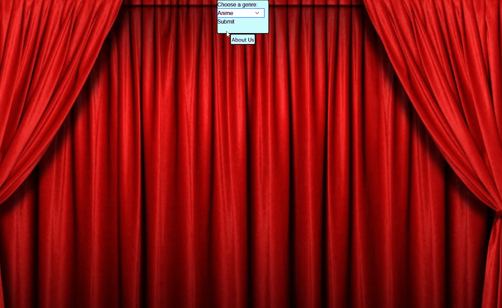

## Finding Flix - Tinder for Movies

## Description

Finding Flix is a web based application that aims to simplify the process of finding your new favorite movie. With so many options to watch and a slew of streaming platforms to choose from, Finding Flix attempts to streamline & simplfy these choices for users. 

Users can select a genre of their choice, once chosen the user will be shown a card stack of potential matches, which they can swipe through to either "match" with or disregard. Once the user has swiped through all of their cards, their matches will be stored in a list displayed to them that will also display where the user can view the program.

Information provided is but not limited to...
-Locations to view said program
-Fun card-style swipe system reminiscent of dating apps to build users unique match 
profile

## Installation
To install/use Finding Flix users can simply access the application via the live link in our repository: 

## Usage

Aimed usuage is to assist users in finding a new movie to watch, and where they can watch it

## Drop down menu functionality 

## Card functionality 

## About us page

## Credits

Collaborators on this project include:
[Brett Vanhoose, ](https://github.com/m-vanhoose)
[Eric Jacob, ](https://github.com/EricJacob99)
[Janiece Lewis, ](https://github.com/Janiece-Lewis) 
[Abdiaziz Aden, ](https://github.com/AzizAden)
[Raven Evans, ](http://github.com/are-jae)
[Madi Schneider.](https://github.com/madischneider3)

## Badges

## Features
Genre selection- Users are greeted with a drop down menu featuring 11 genres for selection

Card stack - Once the user has submitted their genre preferance, they are then shown a stack of 5 cards, each displayiing different movies and what platform the user can view them on. Users can "love" or "nope" any title by simply clicking the corresponding button to advance to the next card

Coming soon - 

Ability for the users "loved" titles to be displayed to them in list format after the selection process

Card swiping functionaility
